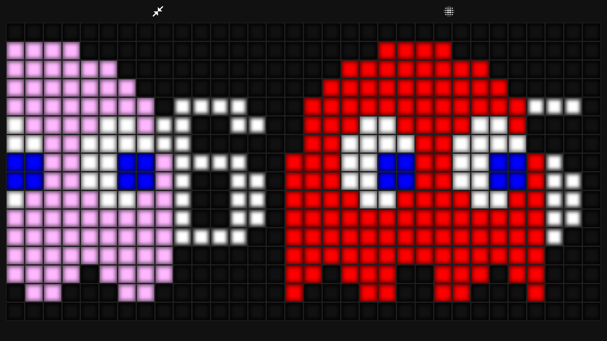

# 🕹️ Pac-Man Clock


ドット絵のマトリクスパネル上に現在時刻を表示し、Pac-Man とゴーストたちがその上を走り抜ける、レトロ風のデジタル時計です。純粋な HTML / CSS / JavaScript のみで動作し、ライブラリやビルド環境は不要です。

## 📸 スクリーンショット



## ✨ 特徴

- **リアルタイム時計** — 32 × 16 のドットマトリクスに `HH:MM` 形式で現在時刻を表示
- **数字アニメーション** — 桁が変わると上の行から下の行へ 1 行ずつ切り替わる
- **キャラクター演出** — Pac-Man と 4 体のゴースト（blinky / pinky / inky / clyde）が定期的に横切る
- **特別演出** — 5 回に 1 回、青いいじけゴースト 4 体が左へ逃げ、Pac-Man が左右反転して追いかける
- **レトロな質感** — 各マスに質感画像を重ねて LED / ネオン風のにじんだ見た目を再現
- **全画面表示** — ワンクリックで全画面に切り替え

## 🚀 使い方

1. 下記のファイルをすべて同じフォルダに置きます。
2. `Retro Clock.html` を Web ブラウザで開きます。
3. 現在時刻が表示され、自動的にキャラクター演出が始まります。
4. 右上のボタンで全画面表示を切り替えられます。

サーバーは不要で、ファイルを直接開くだけで動作します。ただし全画面 API はブラウザによって安全なコンテキスト（HTTPS など）を要求する場合があります。

## 📦 構成ファイル

| ファイル | 役割 |
|----------|------|
| `Retro Clock.html` | 画面の骨組み。時計パネルと操作ボタンのコンテナを定義 |
| `script.js` | ドット絵データ、時計描画、数字アニメーション、キャラクター演出、全画面制御 |
| `style.css` | レイアウト、各マスの色・質感、コロンの点滅などのスタイル |
| `light-60.png` | 各マスに敷く質感（にじみ）用の背景画像 |
| `favicon.ico` | ブラウザタブ用のアイコン（任意） |

## ⚙️ 仕組み

### ドットマトリクス

`createPixelGrid()` が 32 × 16 個の `div.pixel` 要素を 2 面ぶん生成します。下段（`bottom`）は時計の数字用、上段（`top`）はキャラクター用のレイヤーです。各マスは `bottom-x-y` / `top-x-y` という ID を持ちます。

### ドット絵データ

`pixelData` 配列が、数字・コロン・各キャラクターの見た目を文字列の 2 次元グリッドとして保持します。グリッド内の 1 文字が 1 マスの色に対応します。

| 記号 | 色 / 意味 |
|------|-----------|
| `0` | 消灯（透明） |
| `1` / `W` | 白 |
| `L` | コロン |
| `R` | 赤（blinky） |
| `P` | ピンク（pinky） |
| `C` | シアン（inky） |
| `O` | オレンジ（clyde） |
| `F` | 青（いじけゴースト） |
| `Y` | 黄（Pac-Man） |
| `B` | 青（目など） |

### 時刻表示と数字アニメーション

`displayTimeDigits()` が現在時刻を 4 桁に分解し、前回表示と比較して、変化した桁だけを `animateDigitTransition()` に渡します。アニメーションは 8 行ぶんを上から順に切り替えて、なめらかな数字の遷移を表現します。

### キャラクター演出

`countDownToGroupRelease()` が一定秒ごとに `releaseTheGroup()` を呼び出します。通常回は Pac-Man に続いてゴースト 4 体が右へ流れます。5 回に 1 回の特別回では、いじけゴースト 4 体が左へ逃げ、そのあとを Pac-Man が左右反転して追いかけます。

## 🔧 主な設定値

`script.js` 冒頭付近の変数を変更すると挙動を調整できます。

```js
var xWidth = 32;                  // 横のマス数
var yHeight = 16;                 // 縦のマス数
var yOffset = 4;                  // 数字の縦位置オフセット（上4マス空け）
var characterSpeed = 40;          // キャラクター移動の速さ（ミリ秒／小さいほど速い）
var releaseDelay = 15;            // キャラクター演出の発生間隔（秒）
var digitTransitionDuration = 720; // 数字切り替えアニメの所要時間（ミリ秒）

```

## 🎨 カスタマイズ例

- 数字やキャラクターの見た目を変えたい場合は、`pixelData` 内の対応する `grid` を編集します。
- 色を変えたい場合は、`style.css` の `.pixel-*` クラスの `background-color` を調整します。
- にじみの質感を差し替えたい場合は、`light-60.png` を別画像に置き換えます。

## 💻 動作環境

- Material Icons と Google Fonts をオンラインで読み込むため、アイコン表示にはインターネット接続が必要です。
- 全画面表示は Fullscreen API に対応したブラウザで利用できます。

## 📄 ライセンス

プロジェクトの利用条件に合わせて記載してください（例: MIT License）。
